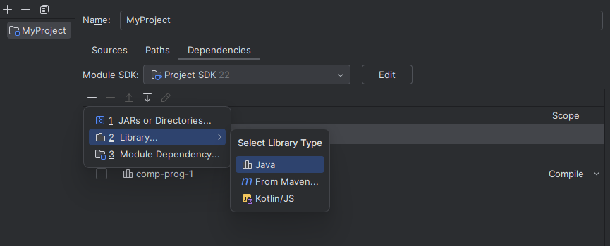
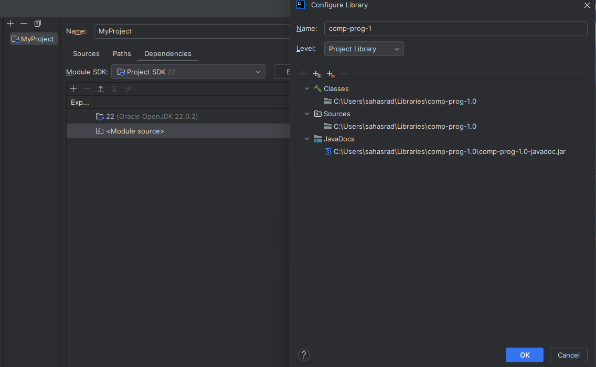

# Installation Instructions
## Option 1: Add to dependency list of your favorite build tool.
Must be compatible with the Maven Central Repo. Examples for Maven and Gradle are shown below.
### Maven:
```xml
<dependency>
    <groupId>dev.sahasrad</groupId>
    <artifactId>comp-prog</artifactId>
    <version>1.0.1</version>
</dependency>
```
### Gradle:
```gradle
implementation group: 'dev.sahasrad', name: 'comp-prog', version: '1.0.1'
```
## Option 2: Download and Extract ZIP
A ZIP file of the dependency JARs is provided for the latest [release](https://github.com/SahasradC/comp-prog/releases).

Extract comp-prog-VERSION.zip and add the created comp-prog-VERSION folder as a project library in your IDE.

### For IntelliJ:
Navigate to `File > Project Structure > Modules > Dependencies`

You can either add the comp-prog-VERSION folder as a dependency directory:

 

Or add the directory as a library and manually assign the Classes, Sources, and JavaDoc JAR files.




Both methods should produce the same result.


If you want to import the library without documentation, only add comp-prog-VERSION.jar as a dependency.

